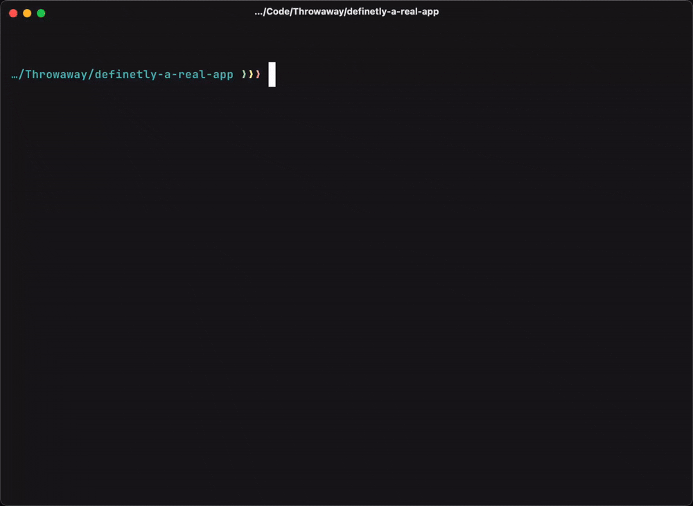

# Tether

Link local composer packages to your sandbox for local development.

## Rationale

It's easy to setup a composer repository for local package development. 

However, it's not long until you face dependency conflicts, or issues trying to ensure CSS/JS assets are symlinked correctly.

This package (if you can even call it that) discovers which packages you have cloned down, and lets you easily symlink them into your sandbox application.

## Installation

1. Use macOS
2. Install [Gum](https://github.com/charmbracelet/gum) & [jq](https://github.com/jqlang/jq)
3. Download `tether.sh` into your `/usr/local/bin` directory and give it the relevant permissions:
    ```
    curl -o /usr/local/bin/tether https://raw.githubusercontent.com/duncanmcclean/tether/main/tether.sh
    sudo chmod +x /usr/local/bin/tether
    ```
4. Add `/usr/local/bin` to your `PATH` if you haven't already:
    ```bash
    export PATH=/usr/local/bin:$PATH
    ```

## Usage

To link a local composer package, clone it into your `~/Code`, `~/Herd` or `~/Valet` directory. 

Then, in your sandbox app, run `tether` and select the package you wish to link. Tether will setup a Composer repository and symlink the relevant assets.



You may also pass the package name to the command, like this:

```sh
tether statamic/cms
```

### Dependency conflicts

If you're running into conflicts when linking a package, you may use the `--force` flag to bypass the Composer repository/install process and symlink the package's `vendor` directory directly. 

Although, be careful as running `composer install` in your app may destroy the symlink.

## Contributing

1. Fork the repository
2. Clone down locally
3. Ensure `tether.sh` has the right permissions:
    ```bash
    sudo chmod +x /path/to/your/clone/tether.sh
    ```
4. Symlink to `/usr/local/bin`:
    ```bash
    sudo ln -s /path/to/your/clone/tether.sh /usr/local/bin/tether
    ```